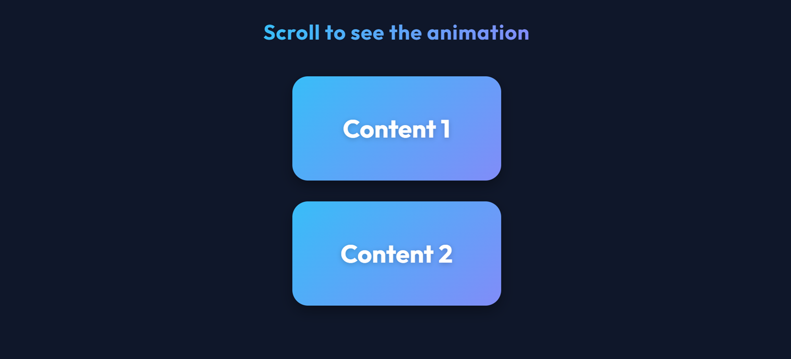

# Scroll Animation

A dynamic, interactive scroll animation project built with HTML, CSS, and Vanilla JavaScript.

## Features
- Smooth reveal animations triggered by scrolling.
- Responsive design that works across various devices.
- Lightweight implementation using pure JavaScript (no external libraries).
- Modular CSS structure for easy customization.

## Technologies Used
- HTML5
- CSS3 (Transitions, Keyframes, Flexbox)
- JavaScript (Intersection Observer API / Scroll Events)

## How to Run
Simply open `index.html` in any modern web browser.